# Project 1 Planning: The Unofficial Guide

> Write this document before you write any pipeline code.
> Your spec and architecture diagram are what you'll use to direct AI tools (Claude, Copilot, etc.) to generate your implementation — the more specific they are, the more useful the generated code will be.
> Update the Retrieval Approach and Chunking Strategy sections if you change your approach during implementation.
> Update this file before starting any stretch features.

---

## Domain

The domain is informal student reviews of FIU CS professors. While RateMyProfessors is a publicly accessible resource, this type of knowledge is still valuable because it captures student-to-student discourse that official channels do not produce. FIU's official faculty evaluations are private, aggregated, and never shared publicly. The informal, unfiltered language students use to describe teaching quality, course difficulty, and grading style represents a form of collective knowledge that exists outside institutional channels.

---

## Documents

<!-- List your specific sources: URLs, subreddit names, forum threads, or file descriptions.
     Aim for at least 10 sources that together cover different subtopics or perspectives within your domain. -->

| # | Source | Description | URL or location |
|---|--------|-------------|-----------------|
| 1 |Rate My Professor page (Kianoosh Boroojeni)        |68 ratings, 4.3 |https://www.ratemyprofessors.com/professor/2295919 |
| 2 |Rate My Professor page (Richard Whittaker)         |354 ratings, 4.8 |https://www.ratemyprofessors.com/professor/1935348 |
| 3 |Rate My Professor page (Caryl Rahn)                |179 ratings, 2.1 |https://www.ratemyprofessors.com/professor/2044920 |
| 4 |Rate My Professor page (Patricia McDermott Wells)  |149 ratings, 3.9 |https://www.ratemyprofessors.com/professor/241078 |
| 5 |Rate My Professor page (Jill Weiss)                |354 ratings, 4.6 |https://www.ratemyprofessors.com/professor/300089 |
| 6 |r/FIU Reddit Thread (How is Computer Science?)     |2 years old, incoming student asking about current CS students' experiences in FIU|https://www.reddit.com/r/FIU/comments/1f5j4vt/how_is_computer_science/ |
| 7 |r/FIU Reddit Thread (Discrete Structures)          |5 years old, asking about professors for course Discrete Structures |https://www.reddit.com/r/FIU/comments/17rr3kg/discrete_structures/ |
| 8 |Rate My Professor page (Ahmad Waqas)               |115 ratings, 4.2 |https://www.ratemyprofessors.com/professor/2736433 |
| 9 |Rate My Professor page (Michael Robinson)          |312 ratings, 3.4 |https://www.ratemyprofessors.com/professor/1591088 |
| 10|r/FIU Reddit Thread (Help picking CS professors)   |6 years old, original post deleted |https://www.reddit.com/r/FIU/comments/jry3og/help_picking_cs_professors/ |

---

## Chunking Strategy

<!-- How will you split documents into chunks?
     State your chunk size (in tokens or characters), overlap size, and explain why those
     numbers fit the structure of your documents.
     A review-heavy corpus warrants different chunking than a long FAQ. -->

**Chunk size:**
1 chunk per review/comment

**Overlap:**
0

**Reasoning:**
RateMyProfessors reviews are typically 50–200 words, and Reddit comments vary similarly, splitting at review/comment boundaries preserves meaning well. Overlap is unnecessary because reviews are independent of eachother.
In rare cases where a Reddit comment is unusually long, it may exceed typical chunk size guidelines, but this is uncommon enough in this domain that review-level chunking remains the best fit.

---

## Retrieval Approach

<!-- Which embedding model are you using (e.g., all-MiniLM-L6-v2 via sentence-transformers)?
     How many chunks will you retrieve per query (top-k)?
     If you were deploying this for real users and cost wasn't a constraint, what tradeoffs
     would you weigh in choosing a different embedding model — context length, multilingual
     support, accuracy on domain-specific text, latency? -->

**Embedding model:**
nomic-embed-text

**Top-k:**
5-10

**Production tradeoff reflection:**
My other consideration was all-MiniLM-L6-v2 which is comparatively less heavy but for the purposes of this project that is not a problem. For this specific domain nomic-embed-text is a better choice for the following reasons:
The native prefix support is a direct match for my prefix prompting approach.
Short opinion text benefits from the higher-dimensional representation capturing subtle sentiment differences
It's built with both similarity and retrieval in mind.

---

## Evaluation Plan

<!-- List your 5 test questions with their expected correct answers.
     Questions should be specific enough that you can judge whether the system's response
     is right or wrong. "What are good dining halls?" is too vague.
     "What do students say about wait times at [dining hall name] during lunch?" is testable. -->

| # | Question | Expected answer |
|---|----------|-----------------|
| 1 |"What do students say about Caryl Rahn's grading style?" | Students say Caryl Rahn's grading style is unfair and unnecessarily stressful. |
| 2 |"Is Kianoosh Boroojeni known for steep curving?" |Yes, Kianoosh gives tough exams but he is known for generous curving so your grade won't suffer much. |
| 3 |"What complaints do students most commonly have about FIU CS professors?" |The most common complaints are perceived communication barriers, lack of responsiveness, and tough workloads.  |
| 4 |"Do students find Richard Whittaker's exams fair?" |Exams are fair and one to one with prior exam reviews, however they usually make up 90% of the grade and exam dates are unnegotiable |
| 5 |"How do students describe the workload in COT3100(Discrete Structures) at FIU?" |It can depend on professor but generally students describe COT3100 as heavy on proofs and problem sets, with weekly homework and difficult exams. |

---

## Anticipated Challenges

<!-- What could go wrong? Name at least two specific risks with reasoning.
     Consider: noisy or inconsistent documents, missing source attribution, off-topic
     retrieval, chunks that split key information across boundaries. -->

1. Data quality could be impacted by the fact that teaching styles change and many of these reviews were made years ago.

2. Some of my expected answers are partially formed from prior knowledge (I had many of these professors) so I may unconsciously evaluate the system as correct when it matches what I already believe rather than what the sources actually say.

---

## Architecture

```mermaid
---
config:
  layout: elk
---
flowchart LR
    B["LangChainPer Review Split"] -- Documents --> C["nomic-embed-text"]
    C -- Embeddings --> D["Chroma Vector DB"]
    E["Query"] -- Embed --> C
    C -- Query Embedding --> F["ChromaCosine Similarity"]
    D --> F
    F -- Top Results --> G["Claude"]
    G -- Generated Response --> H["Output"]
    A@{ label: "RMP GraphQL Fetcher" } --> B

    A@{ shape: rect}
    B:::processing
    C:::embedding
    D:::vectorDB
    E:::embedding
    F:::vectorDB
    G:::llm
    H:::output
    A:::dataSource
    classDef dataSource stroke:#818cf8,fill:#eef2ff
    classDef processing stroke:#2dd4bf,fill:#f0fdfa
    classDef embedding stroke:#a78bfa,fill:#f5f3ff
    classDef vectorDB stroke:#38bdf8,fill:#f0f9ff
    classDef llm stroke:#fb923c,fill:#fff7ed
    classDef output stroke:#4ade80,fill:#f0fdf4
```

---

## AI Tool Plan

<!-- For each part of the pipeline below, describe:
     - Which AI tool you plan to use (Claude, Copilot, ChatGPT, etc.)
     - What you'll give it as input (which sections of this planning.md, which requirements)
     - What you expect it to produce
     - How you'll verify the output matches your spec

     - I will provide Claude with my sources, chunking strategy, and retrieval approach 

     "I'll use AI to help me code" is not a plan.
     "I'll give Claude my Chunking Strategy section and ask it to implement chunk_text()
     with my specified chunk size and overlap" is a plan. -->

**Milestone 3 — Ingestion and chunking:**

**Milestone 4 — Embedding and retrieval:**

**Milestone 5 — Generation and interface:**
